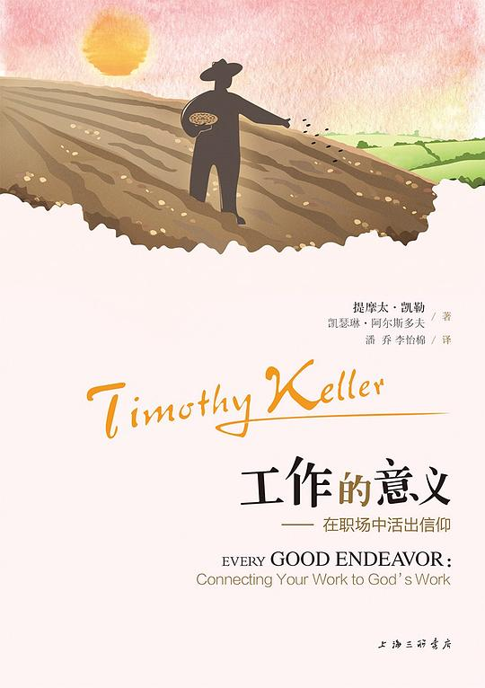
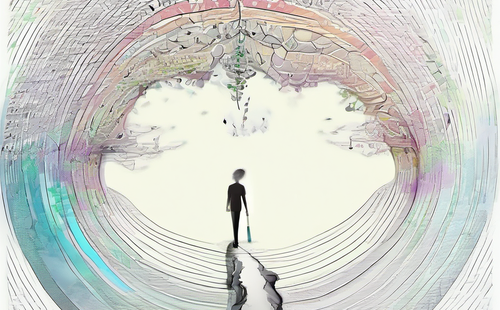

# 1.3 工作承载不了太多意义，但也不要陷入工作虚无主义

## 关于工作的两个极端

最近在程序员群里，经常看到两种极端的声音：

### 极端1：工作就是生活的全部

- "不加班怎么能进步？"
- "不卷怎么能成功？"
- "工作就是生活的意义啊！"
- "多干活才能有未来！"

这帮人把工作当成了人生的全部，仿佛不工作就活不下去了。每天加班到深夜，周末也在想工作，朋友圈全是技术文章...

### 极端2：工作就是浪费生命

- "工作不就是为了赚钱吗？"
- "反正都是给老板打工"
- "上班就是浪费生命"
- "能摸鱼就摸鱼"

这些人觉得工作毫无意义，上班就是在消耗生命，恨不得立马辞职去流浪。

## 为什么会有这两种极端？

### 1. 社会压力
- 房贷车贷的压力
- 35岁危机的焦虑
- 同龄人的对比
- 父母的期望

### 2. 互联网的放大效应
- 成功学的洗脑
- 躺平学的诱惑
- 各种极端观点的传播
- 戾气的积累

### 3. 个人认知的局限
- 把工作等同于生活
- 把收入等同于价值
- 把职位等同于能力
- 把忙碌等同于进步

## 工作到底承载了什么？

### 1. 最基本的：生存需求
- 温饱（这是最基本的）
- 房子（安身之所）
- 车子（代步工具）
- 医疗保险（以防万一）

### 2. 进阶的：成长需求
- 技能提升
- 视野拓展
- 人脉积累
- 经验沉淀

### 3. 更高层的：自我实现
- 成就感
- 价值认同
- 社会贡献
- 个人影响力

## 工作的真相是什么？

### 1. 工作既不是全部，也不是虚无
- 它是生活的一部分，但不是全部
- 它有它的价值，但不是唯一的价值
- 它值得认真对待，但不要太较真
- 它需要投入，但不是无限投入

### 2. 工作是一种平衡
- 在理想和现实之间
- 在付出和收获之间
- 在个人和团队之间
- 在工作和生活之间

### 3. 工作是一个过程
- 不是终点，而是旅程
- 不是结果，而是经历
- 不是负担，而是选择
- 不是束缚，而是机会

## 如何找到平衡？

### 1. 给工作一个合适的位置
- 不要把它看得太重
- 也不要把它看得太轻
- 找到自己舒服的节奏
- 保持健康的距离

### 2. 建立多元的生活
- 工作之外要有爱好
- 职场之外要有朋友
- 技术之外要有兴趣
- 收入之外要有追求

### 3. 保持清醒的认知
- 知道自己要什么
- 明白自己在做什么
- 清楚自己能做什么
- 了解自己该做什么

## 一些具体建议

### 1. 工作时间
- 正常下班就走
- 周末尽量不加班
- 休假要好好休
- 摸鱼要有度

### 2. 工作态度
- 该认真时认真
- 该放松时放松
- 该拒绝时拒绝
- 该妥协时妥协

### 3. 工作方法
- 提高效率，而不是延长时间
- 追求质量，而不是堆砌数量
- 注重成长，而不是纯粹付出
- 讲求方法，而不是蛮干

## 结语

工作就像人生的一个维度：
- 它很重要，但不是唯一
- 它需要投入，但要有度
- 它值得认真，但别太执着

记住：
- 工作是为了更好的生活，而不是让生活成为工作的附属品
- 认真工作，快乐生活
- 既不做工作的奴隶，也不做生活的逃兵

最后，送大家一句话：
工作和生活就像代码和注释，缺一不可，但要比例适当。

